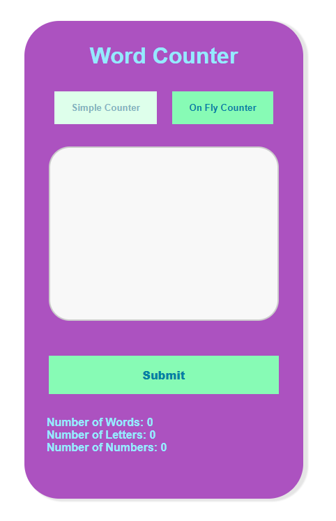

# Voxy Code Challenge

The application aims to count the number of words, letters and numbers that are entered in the text box, disregarding special characters.

<p align="center">
    
</p>

## Prerequisites

- [Nodejs](https://nodejs.org/)

## Installation

In the project root directory, run

```
npm i
```

## Run the project

In the project root directory, run

```
npm run dev
```

Then access the following address in your browser

[http://localhost:5174/](http://localhost:5174/)
